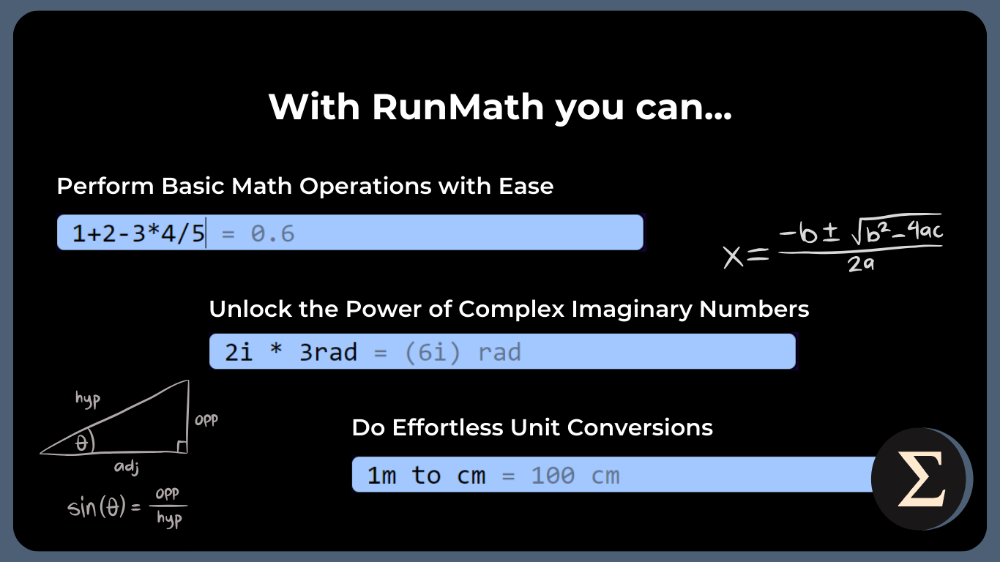
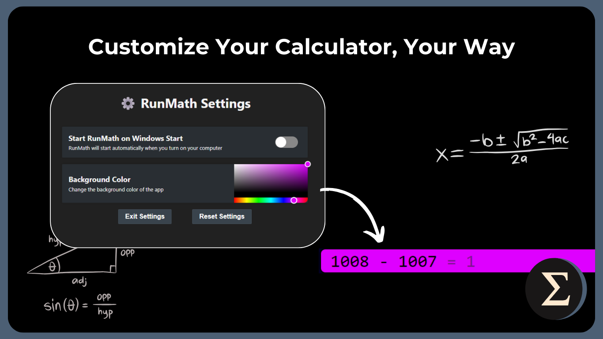

  

<h1 align="center">RunMath</h1>

  <strong>A keyboard-first calculator for Windows - Do math, <i>quickly 🚀</i></strong>
   
  <i>Built with ❤️‍🔥 by <a href="https://github.com/dubisdev">@dubisdev</a></i>

  <a href="https://github.com/dubisdev/runmath/releases/latest">
    🔗 Go to Download Page
  </a>
    &nbsp; | &nbsp; Give it a Star ⭐ | &nbsp;
    <a href="https://www.buymeacoffee.com/dubisdev">Support the project 🤝</a>

  
  

## 🧮 Features

- `Basic math operations`: `+`, `-`, `x`, `/`, `%`, `^`, `√`, `!`,...
- `Complex numbers` (ex: 2i * 8i = -16)
- `Unit conversion` (ex: 1m to cm = 100)

> **Note**: Feel free to open an issue if you have
> any suggestions or ideas for new features!

## 🚄 Shortcuts

RunMath comes with a few shortcuts to make your life easier:

- Use `up` and `down` arrows to navigate through the history
- `Alt+M` to toggle the visibility of the app (M stands for math 👀)
- `Alt+Q` to quit the app
- `Alt+S` opens the settings
- `Enter` copies the result to the clipboard and clears the input
- `=` saves the result to the history
- `tab` to select the input
- `esc` to clear the input

## ⚙️ Settings

Configure the app to your liking! For now, you can change:

- Background color
- Run app on startup or not
- Use Big Numbers (for calculations with big numbers > 15 digits)
- Output format (scientific, fixed, engineering, auto)
- Hide on Enter

## 🔐 Privacy Policy

RunMath does NOT:

- collect any personal information,
- track you,
- send your keystrokes to any server,
- send any data to any server.

All the calculations are done locally on your computer.
Your preferences are stored locally on your computer.

The Windows Store version does not have update checks,
so it does not connect to any server.

## ⚖️ License

[MIT](./LICENSE.md) © [David Jimenez](https://dubis.dev)
