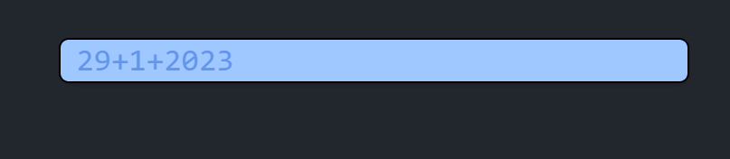

  

<h1 align="center">RunMath</h1>

A keyboard-first calculator for Windows - Do math, <i>quickly 🚀</i>

  <a href="https://github.com/dubisdev/runmath/releases/latest">
    🔗 Go to Download Page
  </a>
    &nbsp; | &nbsp; Give it a Star ⭐ | &nbsp;
    <a href="https://www.buymeacoffee.com/dubisdev">Support the project 🤝</a>
    &nbsp; | &nbsp;
    <a href="https://twitter.com/intent/tweet?text=I%27m%20using%20%23RunMath%20-%20A%20keyboard-first%20alternative%20to%20the%20Windows%20calculator%20by%20%40dubisdev%0A%0Ahttps%3A%2F%2Fgithub.com%2Fdubisdev%2Frunmath">
      Share it on Twitter 🐦
    </a>

## 🧮 Features

- `Basic math operations`: `+`, `-`, `x`, `/`, `%`, `^`, `√`, `!`,...
- `Complex numbers` (ex: 2i * 8i = -16)
- `Unit conversion` (ex: 1m to cm = 100)

## 🚄 Shortcuts

RunMath comes with a few shortcuts to make your life easier:

- Use `up` and `down` arrows to navigate through the history
- `Alt+M` to toggle the visibility of the app (M stands for math 👀)
- `Alt+Q` to quit the app
- `Alt+S` opens the settings
- `Enter` copies the result to the clipboard and clears the input
- `=` saves the result to the history
- `tab` to select the input
- `esc` to clear the input

## ⚙️ Settings

Configure the app to your liking! For now, you can change:

- Background color
- Run app on startup or not

## 🔜 Roadmap

- [ ] Settings
  - [ ] Colors
  - [ ] Font size
  - [ ] Font
  - [ ] Variables?
- [ ] Print functions

## ⚖️ License

[MIT](./LICENSE.md) © [David Jimenez](https://dubis.dev)
